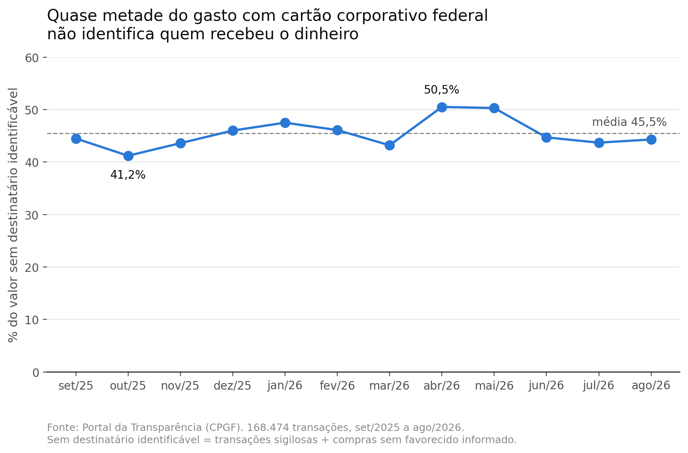
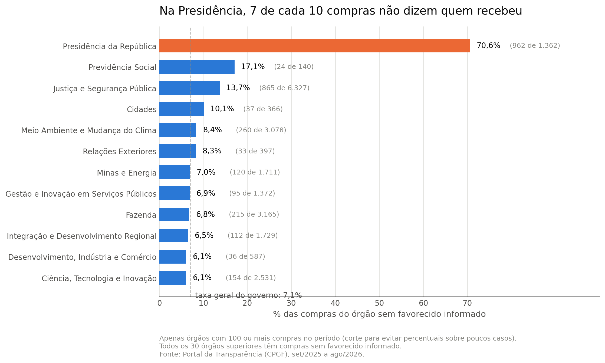

# Cartão corporativo do governo federal: 45% do valor declarado não diz quem recebeu

Análise de 12 meses de extratos do Cartão de Pagamento do Governo Federal (CPGF), publicados no Portal da Transparência, para medir quanto do gasto permite identificar o destinatário do dinheiro público.

## Resultado principal

Entre setembro de 2025 e agosto de 2026, o governo federal registrou **R\$ 126.746.464,31** (cerca de 126 milhões e 700 mil reais) em gastos com cartão de pagamento. Desse total, **R\$ 57.577.660,01** (cerca de 57 milhões e 600 mil reais), ou **45,4%**, não permitem identificar quem recebeu o dinheiro.

| Situação | Valor | % do total |
|---|---|---|
| Transações sigilosas | R\$ 49.565.348,32 (cerca de 49 milhões e 600 mil) | 39,1% |
| Compras sem favorecido informado | R\$ 8.012.311,69 (cerca de 8 milhões) | 6,3% |
| **Sem destinatário identificável** | **R\$ 57.577.660,01 (cerca de 57 milhões e 600 mil)** | **45,4%** |
| Saques em dinheiro | R\$ 9.402.338,45 (cerca de 9 milhões e 400 mil) | 7,4% |
| Compras com destinatário identificado | R\$ 59.766.465,85 (cerca de 59 milhões e 800 mil) | 47,2% |

Em número de transações, e não em valor, são **50.984 das 168.474 (30,3%)** sem destinatário identificável. A diferença entre os dois percentuais tem um motivo: essas transações são individualmente maiores que as demais, como mostra a seção seguinte.

A proporção do valor sem destinatário identificável ficou entre **41,2% e 50,5% em todos os 12 meses**, sem nenhum mês abaixo de 41%. Não é um episódio isolado: é o comportamento normal desses dados.

Somando os saques, em que o dinheiro sai em espécie e o destino final não é registrado em lugar nenhum, **52,8% do valor** e **38,6% das transações** não chegam a um recebedor identificável.

---

## O que chama atenção

Cinco coisas que os dados mostram e que merecem explicação pública.

### 1. Três quartos das transações sigilosas têm exatamente R\$ 1.000,00

O valor **R\$ 1.000,00 aparece 32.502 vezes** entre as 43.030 transações sigilosas: **75,5% de todas elas**, somando R\$ 32,5 milhões, ou 65,6% de todo o valor sigiloso do período.

| | Múltiplos de R\$ 50 |
|---|---|
| Transações sigilosas | **80,1%** |
| Compras identificadas | 14,0% |

Compras em estabelecimentos comerciais não produzem essa distribuição: preços reais raramente são redondos, e é por isso que as compras identificadas ficam em 14%. Uma concentração de três quartos das transações num único valor exato indica que esses registros não são preços de compras.

Duas hipóteses, que os dados públicos não decidem:
1. O valor publicado para transações sigilosas é substituído por um valor padrão, e não é o valor real.
2. São repasses ou adiantamentos de valor fixo, e não compras.

**Isso afeta o próprio resultado desta análise**, e a limitação está declarada [mais abaixo](#limitações).

### 2. As transações sigilosas são individualmente muito maiores

| Grupo | Transações | Valor total | Mediana | Maior |
|---|---|---|---|---|
| Sigiloso | 43.030 | R\$ 49.565.348,32 | R\$ 1.000,00 | R\$ 185.023,51 |
| Saque | 14.051 | R\$ 9.402.338,45 | R\$ 700,00 | R\$ 20.000,00 |
| Compra sem favorecido | 7.954 | R\$ 8.012.311,69 | R\$ 368,00 | R\$ 80.766,40 |
| Compra identificada | 103.439 | R\$ 59.766.465,85 | R\$ 266,47 | R\$ 52.343,80 |

A mediana de uma transação sigilosa é quase **quatro vezes** a de uma compra identificada. A maior transação de todo o período também é sigilosa: **R\$ 185.023,51** (cerca de 185 mil reais). O sigilo não cobre o gasto miúdo do dia a dia: cobre as operações de maior valor.

### 3. Existem compras que não identificam ninguém, e não são sigilosas

São **7.954 compras** em 12 meses, somando **R\$ 8.012.311,69** (cerca de 8 milhões de reais). Nessas linhas:

- `NOME FAVORECIDO` traz o texto `SEM INFORMACAO`;
- `CNPJ OU CPF FAVORECIDO` traz o número `-1`, idêntico em 100% dos casos.

O `-1` não é um documento: CNPJ tem 14 dígitos e nunca é negativo. Como o valor se repete nas 7.954 linhas, é um código de preenchimento. Não é o caso de só o nome ter se perdido: **não há nome nem documento do recebedor**.

Todas são compras. Nenhum saque aparece nesse grupo, porque saque usa outro código (`-2`, com o texto "NAO SE APLICA"). Ou seja, o sistema distingue "não se aplica" de "não informado", e o `-1` é usado justamente onde existe um estabelecimento que recebeu o pagamento, mas ele não foi registrado.

Diferente do sigilo, **essa categoria não tem amparo legal declarado nem documentação**: o [Dicionário de Dados do CPGF](https://portaldatransparencia.gov.br/pagina-interna/603393-dicionario-de-dados-cpgf) não menciona o valor `SEM INFORMACAO` nem os códigos negativos.

### 4. Na Presidência da República, quase nada é rastreável

Todos os 30 órgãos superiores têm compras sem favorecido informado, numa taxa de base de 4% a 9% das compras. A Presidência está dez vezes acima: **962 das suas 1.362 compras, ou 70,6%**.

Esse número se soma a outro: **99,3% do gasto total da Presidência no período está classificado como sigiloso**. Do pouco que sobra fora do sigilo, a maior parte também não identifica o recebedor.

O efeito disso aparece quando se separa o gasto aberto do sigiloso: a Presidência cai do **3º para o 21º lugar** entre os maiores gastadores, com R\$ 11,4 mil em compras abertas.

### 5. A falta de identificação se concentra nas compras de maior valor

As compras sem favorecido são 7,1% das compras, mas **11,8% do valor comprado**.

| Medida | Sem favorecido | Com favorecido |
|---|---|---|
| Mediana | R\$ 368,00 | R\$ 266,47 |
| 1º quartil | R\$ 106,65 | R\$ 108,50 |
| 3º quartil | R\$ 1.000,00 | R\$ 636,02 |
| Maior compra | R\$ 80.766,40 | R\$ 52.343,80 |

A diferença não é um deslocamento uniforme: no 1º quartil os dois grupos são praticamente iguais (R\$ 106,65 contra R\$ 108,50), ou seja, entre as compras pequenas a chance de ficar sem favorecido é a mesma. A diferença aparece e cresce conforme o valor sobe. **A maior compra de todo o período, de R\$ 80.766,40 (cerca de 80 mil reais), está entre as que não identificam o recebedor.**

---

## Problema

O sigilo em gastos com cartão corporativo já foi tema de reportagens. O que esta análise encontrou e não está documentado em lugar nenhum é a segunda categoria: compras comuns, não classificadas como sigilosas, em que o campo do favorecido simplesmente não está preenchido.

A pergunta que guiou o trabalho: quanto do gasto com cartão corporativo é rastreável até quem recebeu o dinheiro, e o que explica a parte que não é?

## Dados

- **Fonte:** [Portal da Transparência — CPGF](https://portaldatransparencia.gov.br/download-de-dados/cpgf), arquivos CSV de dados abertos.
- **Período:** extratos de setembro de 2025 a agosto de 2026 (12 arquivos).
- **Volume:** 168.474 transações, 15 colunas, 30 órgãos superiores.
- **Dados reais**, não sintéticos. Nenhum valor foi gerado ou estimado.

Os arquivos seguem o padrão brasileiro: colunas separadas por `;`, codificação `latin1` e vírgula como separador decimal.

## Método

1. **Leitura e junção.** Os 12 arquivos são lidos num laço e empilhados com `pd.concat`, o que torna a análise reprodutível: um mês novo é só um arquivo a mais na pasta.
2. **Classificação de cada transação** em quatro grupos que não se sobrepõem: sigilosa, saque, compra sem favorecido e compra identificada.
3. **Agregação por mês e por órgão**, sempre em porcentagem além do valor absoluto, porque dois meses do período têm volume muito abaixo da média.
4. **Perfil de valor** de cada grupo, usando mediana e quartis em vez de média, porque a distribuição é fortemente puxada por valores altos.
5. **Teste de arredondamento** dos valores, comparando a proporção de múltiplos de 50 entre os grupos.

Ferramentas: Python, pandas e matplotlib, em notebook do Google Colab.

## Validação

Cada conclusão passou por uma verificação explícita:

- **As linhas sem data são exatamente as sigilosas.** O extrato de agosto tem 3.926 linhas sem `DATA TRANSAÇÃO` e exatamente 3.926 transações marcadas como sigilosas. Os dados faltantes não são erro de leitura: são o sigilo.
- **As duas categorias de opacidade não se sobrepõem.** O cruzamento de "sigiloso" com "sem favorecido" retorna 0 linhas, então os valores podem ser somados sem contagem dupla.
- **Os quatro grupos cobrem o conjunto inteiro.** A soma deles dá 168.474 transações, igual ao total: nenhuma ficou de fora nem foi contada duas vezes.
- **A junção dos 12 arquivos não perdeu nem duplicou linhas.** O mês de agosto aparece no conjunto com 15.237 transações, o mesmo número obtido ao ler o arquivo isoladamente.
- **Um filtro foi corrigido no meio do caminho.** A primeira versão usava `startswith("COMPRA")` e deixava de fora uma transação do tipo `COMP A/V-SOL DISP C/CLI-R\$ ANT VENC`, de R\$ 191,02. O filtro passou a usar `startswith("COMP")`. A diferença é pequena, mas a origem dela importa: um filtro por texto pode excluir categorias sem avisar.

## Duas correções que valem registrar

**Porcentagem sem denominador engana.** A primeira versão do gráfico 3 ordenava os órgãos apenas pela porcentagem, e o Ministério da Pesca e Aquicultura aparecia em primeiro lugar, com 100%. Ao conferir o denominador, o número se explicou: esse órgão fez **uma única compra** no ano, e ela ficou sem favorecido. Casos semelhantes: Esporte (1 de 14) e Turismo (3 de 22). O gráfico foi refeito incluindo apenas órgãos com pelo menos 100 compras no período e exibindo a fração ao lado de cada barra. O corte de 100 é arbitrário e por isso está declarado.

**Saque não é gasto identificado.** Uma versão anterior deste README somava os saques ao valor "com destinatário identificado". Está errado: num saque o dinheiro sai em espécie e o destino final não é registrado. Os saques passaram a ser uma categoria própria.

## Limitações

- **O valor das transações sigilosas pode não ser o valor real.** Como 75,5% delas têm exatamente R\$ 1.000,00, é possível que o sistema publique um valor padronizado no lugar do verdadeiro. Se for o caso, o total de R\$ 49,57 milhões não corresponde ao efetivamente gasto, e não há como saber, a partir dos dados públicos, se o valor real é maior ou menor. **Por isso o número de 45,4% deve ser lido como a parcela do gasto registrado que não é rastreável, e não como uma medida exata de quanto dinheiro essas transações movimentaram.**
- **Os dados não dizem o motivo do sigilo.** A lei prevê sigilo em casos como segurança e investigação, e o arquivo não informa a justificativa de cada transação. Esta análise mede a extensão do sigilo, não se ele é justificado.
- **Não sei se a informação do favorecido existe nos sistemas internos.** Pode ser informação não publicada ou nunca registrada. É a pergunta 5 do pedido de acesso à informação abaixo.
- **O significado dos códigos `-1` e `-2` não está documentado.** O Dicionário de Dados descreve o campo apenas como "nome do estabelecimento ou da pessoa física que recebeu o pagamento", sem explicar valores especiais. A leitura adotada aqui é a mais razoável a partir do comportamento dos dados, mas quem pode confirmá-la é a CGU.
- **O arquivo não traz o que foi comprado**, só o favorecido. Não é possível avaliar se uma compra é adequada, apenas se ela foge do padrão de valor.
- **Fevereiro (2.675 transações) e março de 2026 (7.729) têm volume muito abaixo da média** de cerca de 14 mil. Não é possível saber, com estes arquivos, se foram meses de baixa atividade ou se os dados estão incompletos. Por isso as comparações entre meses usam porcentagem, não valor absoluto.
- **O mês do extrato não é o mês da transação.** O extrato de agosto de 2026 contém transações realizadas em julho.
- **Os nomes dos órgãos vêm truncados na fonte**, cortados num número fixo de caracteres. Seis nomes foram completados manualmente pela denominação oficial, para os rótulos dos gráficos. A intervenção afeta apenas rótulos, nunca números.
- **A análise é por órgão, não por pessoa.** Os arquivos trazem nomes de servidores portadores dos cartões, que não são usados aqui. Entre os favorecidos há pessoas físicas e MEI, cujos nomes foram substituídos por "pessoa física / MEI" nas tabelas públicas.

## Pedido de acesso à informação

As dúvidas que os dados não respondem foram encaminhadas à Controladoria-Geral da União pela Lei de Acesso à Informação, em 7 de outubro de 2026.

**Protocolo: 00106.024201/2026-61**

O pedido questiona o significado do valor "SEM INFORMACAO", a base legal para publicar transações sem identificar o favorecido, se houve classificação formal de sigilo, se existe documentação técnica dos códigos e se a identificação consta dos sistemas de origem. A resposta, ou a ausência dela, será incorporada a este README.

## Técnicas usadas e por quê

Este projeto **não treina nenhum modelo**, e isso é deliberado: ele é o primeiro de uma sequência em que cada projeto acrescenta uma camada. O que ele exercita é a etapa que antecede qualquer modelo e costuma consumir a maior parte do tempo de um engenheiro de ML na prática.

| Técnica | Como foi usada aqui | Por que importa em ML |
|---|---|---|
| **Ingestão de dados reais** | Leitura de CSV com separador `;`, codificação `latin1` e vírgula decimal, o padrão brasileiro que quebra a leitura default | Dado de produção raramente vem limpo; errar a codificação ou o decimal corrompe os números em silêncio |
| **Pipeline reprodutível** | `glob` + laço + `pd.concat` para ler N arquivos, em vez de código repetido por mês | Um novo mês é só um arquivo a mais na pasta. É a diferença entre uma análise que roda de novo e uma que precisa ser reescrita |
| **Detecção de valores sentinela** | Identificação de `-1`, `-2` e `SEM INFORMACAO` como códigos de preenchimento, não como dados | Valores sentinela entram em modelos como números válidos. Um `-1` tratado como CNPJ real envenena qualquer feature derivada dele |
| **Análise de dados faltantes** | Verificação de que as 3.926 linhas sem data correspondem exatamente às sigilosas | Dado faltante quase nunca é aleatório. Saber *por que* falta decide se a linha é descartada, imputada ou vira uma feature própria |
| **Validação por reconciliação** | Soma dos quatro grupos conferida contra o total; cruzamento das categorias retornando zero; releitura isolada de um mês batendo com o conjunto | É o equivalente a um teste: garante que uma transformação não perdeu nem duplicou registros |
| **Estatística descritiva robusta** | Mediana e quartis em vez de média, porque a distribuição é assimétrica (média R\$ 617,80 contra mediana R\$ 260,00) | Escolher a métrica errada para uma distribuição enviesada produz baselines e avaliações erradas |
| **Detecção de outliers por IQR** | Limite em Q3 + 1,5 × IQR, critério estatístico em vez de um corte escolhido no olho | Critério reprodutível e defensável, aplicável a qualquer coluna numérica sem ajuste manual |
| **Detecção de anomalia por distribuição** | Teste de arredondamento (múltiplos de 50) comparando grupos: 80,1% contra 14,0% | Comparar a distribuição de um grupo com a de um grupo de controle é a base de detecção de anomalia e de *data drift* |
| **Normalização por denominador** | Taxa por órgão em vez de contagem absoluta, com corte mínimo de 100 compras | É o problema de *base rate*: percentuais sobre amostras pequenas enganam, e foi exatamente o erro que apareceu e foi corrigido aqui |
| **Agregação multidimensional** | `groupby` e `pivot_table` por órgão, mês e categoria | A forma de construir features agregadas e de fatiar métricas por segmento |
| **Comunicação de resultado** | Escolha de forma gráfica justificada por tipo de dado, rótulos com a fração ao lado da porcentagem, fonte declarada | Um resultado que o time não entende não vira decisão |
| **Declaração de incerteza** | A seção de limitações aponta que o valor das transações sigilosas pode não ser real, o que enfraquece o próprio número principal | Saber o que o dado *não* sustenta é o que separa uma análise confiável de uma convincente |

**Ferramentas:** Python, pandas, matplotlib, Google Colab, Git e GitHub.

**O que este projeto ainda não tem,** e que entra nos próximos: SQL, modelagem com scikit-learn, API, deploy e testes automatizados.

## Como rodar

1. Baixe os extratos mensais em [Portal da Transparência — CPGF](https://portaldatransparencia.gov.br/download-de-dados/cpgf) e extraia os `.csv` numa pasta.
2. Abra `projeto1_cartao.ipynb` no Google Colab.
3. Envie os `.csv` para a sessão do Colab (ícone de pasta na barra lateral).
4. Execute as células na ordem.

Os arquivos de dados não estão neste repositório por causa do tamanho; o notebook lê qualquer conjunto de arquivos `*CPGF.csv` presentes na pasta.

Dependências: `pandas` e `matplotlib`, ambos já instalados no Colab.

## Autor

Kauã Aurélio — estudante de Inteligência Artificial na Universidade La Salle.
[LinkedIn](https://www.linkedin.com/in/kauaaurelio/) · [X](https://x.com/kauaaurelio_) · [GitHub](https://github.com/kauaaurelio)
