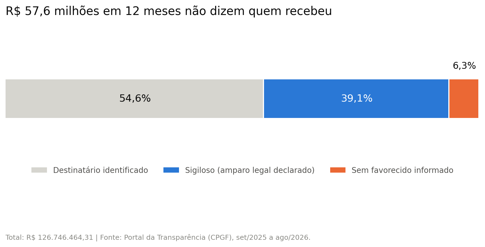

# Cartão corporativo do governo federal: 45% do gasto não diz quem recebeu

Análise de 12 meses de extratos do Cartão de Pagamento do Governo Federal (CPGF), publicados no Portal da Transparência, para medir quanto do gasto permite identificar o destinatário do dinheiro público.

## Resultado principal

Entre setembro de 2025 e agosto de 2026, o governo federal gastou **R\$ 126.746.464,31** com cartão de pagamento. Desse total, **R\$ 57.577.660,01 (45,4%) não permitem identificar quem recebeu o dinheiro**, por duas razões diferentes:

| Situação | Valor | % do total |
|---|---|---|
| Transações sigilosas | R\$ 49.565.348,32 | 39,1% |
| Compras sem favorecido informado | R\$ 8.012.311,69 | 6,3% |
| **Sem destinatário identificável** | **R\$ 57.577.660,01** | **45,4%** |
| Destinatário identificado | R\$ 69.168.804,30 | 54,6% |

A proporção ficou entre **41,2% e 50,5% em todos os 12 meses**, sem nenhum mês abaixo de 41%. Não é um episódio: é o comportamento normal desses dados.

## Problema

O sigilo em gastos com cartão corporativo já foi tema de reportagens. O que esta análise encontrou e não está documentado em lugar nenhum é a **segunda categoria**: compras comuns, não classificadas como sigilosas, em que o campo do favorecido simplesmente não está preenchido.

A pergunta que guiou o trabalho: quanto do gasto com cartão corporativo é rastreável até quem recebeu o dinheiro, e o que explica a parte que não é?

## Dados

- **Fonte:** [Portal da Transparência — CPGF](https://portaldatransparencia.gov.br/download-de-dados/cpgf), arquivos CSV de dados abertos.
- **Período:** extratos de setembro de 2025 a agosto de 2026 (12 arquivos).
- **Volume:** 168.474 transações, 15 colunas, 30 órgãos superiores.
- **Dados reais**, não sintéticos. Nenhum valor foi gerado ou estimado.

Os arquivos seguem o padrão brasileiro: colunas separadas por `;`, codificação `latin1` e vírgula como separador decimal.

## Método

1. **Leitura e junção.** Os 12 arquivos são lidos num laço e empilhados com `pd.concat`, o que torna a análise reprodutível: um mês novo é só um arquivo a mais na pasta.
2. **Classificação de cada transação** em três grupos: sigilosa (`TRANSAÇÃO` = "Informações protegidas por sigilo"), sem favorecido (`NOME FAVORECIDO` = "SEM INFORMACAO") ou identificada.
3. **Agregação por mês e por órgão**, sempre em porcentagem além do valor absoluto.
4. **Perfil de valor** das compras sem favorecido comparado com as identificadas, usando mediana e quartis em vez de média, porque a distribuição é fortemente puxada por valores altos.

Ferramentas: Python, pandas e matplotlib, em notebook do Google Colab.

## Validação

Cada conclusão passou por uma verificação explícita:

- **As linhas sem data são exatamente as sigilosas.** O arquivo tem 3.926 linhas sem `DATA TRANSAÇÃO` no extrato de agosto, e exatamente 3.926 transações marcadas como sigilosas. Os dados faltantes não são erro de leitura: são o sigilo.
- **As duas categorias não se sobrepõem.** O cruzamento de "sigiloso" com "sem favorecido" retorna 0 linhas, então os valores podem ser somados sem contagem dupla.
- **A soma por órgão bate com o total.** Os três órgãos com gasto sigiloso somam exatamente o valor sigiloso do mês.
- **A junção dos 12 arquivos não perdeu nem duplicou linhas.** O mês de agosto aparece no conjunto com 15.237 transações, o mesmo número obtido ao ler o arquivo isoladamente.
- **Um filtro foi corrigido no meio do caminho.** A primeira versão usava `startswith("COMPRA")` e deixava de fora uma transação do tipo `COMP A/V-SOL DISP C/CLI-R\$ ANT VENC`, de R\$ 191,02. O filtro passou a usar `startswith("COMP")`. A diferença é pequena, mas a origem dela importa: um filtro por texto pode excluir categorias sem avisar.

## Resultados

### 1. A opacidade tem duas origens, e só uma tem amparo legal declarado

### 2. As compras sem favorecido não identificam ninguém, nem por nome nem por documento

São **7.954 compras** em 12 meses, somando **R\$ 8.012.311,69**. Nessas linhas:

- `NOME FAVORECIDO` traz o texto `SEM INFORMACAO`;
- `CNPJ OU CPF FAVORECIDO` traz o número `-1`, idêntico em 100% dos casos.

O `-1` não é um documento: CNPJ tem 14 dígitos e nunca é negativo. Como o valor se repete em todas as 7.954 linhas, trata-se de um código de preenchimento. Não é o caso de só o nome ter se perdido: **não há nome nem documento do recebedor**.

Todas são compras. Nenhum saque aparece nesse grupo: saque em caixa eletrônico não tem estabelecimento recebedor e usa outro código (`-2`, com o texto "NAO SE APLICA"). Ou seja, o sistema distingue "não se aplica" de "não informado", e o `-1` é usado justamente onde existe um estabelecimento que recebeu o pagamento, mas ele não foi registrado.

### 3. Acontece nos 30 órgãos, com um ponto fora da curva

Todos os 30 órgãos superiores têm compras sem favorecido informado, numa taxa de base de 4% a 9% das compras. A Presidência da República está dez vezes acima: **962 das suas 1.362 compras (70,6%)**.

Esse número se soma a outro: 99,3% do gasto total da Presidência no período está classificado como sigiloso. Do pouco que sobra fora do sigilo, a maior parte também não identifica o recebedor.

### 4. A falta de identificação se concentra nas compras de maior valor

As compras sem favorecido são 7,1% das compras, mas **11,8% do valor comprado**.

| Medida | Sem favorecido | Com favorecido |
|---|---|---|
| Quantidade | 7.954 | 103.439 |
| Mediana | R\$ 368,00 | R\$ 266,47 |
| 1º quartil | R\$ 106,65 | R\$ 108,50 |
| 3º quartil | R\$ 1.000,00 | R\$ 636,02 |
| Maior compra | R\$ 80.766,40 | R\$ 52.343,80 |

A diferença não é um deslocamento uniforme: no 1º quartil os dois grupos são praticamente iguais (R\$ 106,65 contra R\$ 108,50), ou seja, entre as compras pequenas a chance de ficar sem favorecido é a mesma. A diferença aparece e cresce conforme o valor sobe. **A maior compra de todo o período, de R\$ 80.766,40, está entre as que não identificam o recebedor.**

## Uma correção que vale registrar

A primeira versão do gráfico 3 ordenava os órgãos apenas pela porcentagem, e o Ministério da Pesca e Aquicultura aparecia em primeiro lugar, com 100%. Ao conferir o denominador, o número se explicou: esse órgão fez **uma única compra** no ano, e ela ficou sem favorecido. Casos semelhantes: Esporte (1 de 14) e Turismo (3 de 22).

Uma porcentagem calculada sobre poucos casos não é comparável a uma calculada sobre mais de mil. O gráfico foi refeito com dois ajustes: incluir apenas órgãos com pelo menos 100 compras no período, e exibir a fração ao lado de cada barra, para que o leitor julgue o peso de cada percentual. O corte de 100 é arbitrário e por isso está declarado.

## Limitações

- **Os dados não dizem o motivo do sigilo.** A lei prevê sigilo em casos como segurança e investigação, e o arquivo não informa a justificativa de cada transação. Esta análise mede a extensão do sigilo, não se ele é justificado.
- **Não sei se a informação do favorecido existe nos sistemas internos.** Pode ser informação não publicada ou nunca registrada. É a pergunta 5 do pedido de acesso à informação abaixo.
- **O significado dos códigos `-1` e `-2` não está documentado.** O [Dicionário de Dados do CPGF](https://portaldatransparencia.gov.br/pagina-interna/603393-dicionario-de-dados-cpgf) descreve o campo apenas como "nome do estabelecimento ou da pessoa física que recebeu o pagamento", sem explicar valores especiais. A leitura adotada aqui é a mais razoável a partir do comportamento dos dados, mas quem pode confirmá-la é a CGU.
- **O arquivo não traz o que foi comprado**, só o favorecido. Não é possível avaliar se uma compra é adequada, apenas se ela foge do padrão de valor.
- **Fevereiro (2.675 transações) e março de 2026 (7.729) têm volume muito abaixo da média** de cerca de 14 mil. Não é possível saber, com estes arquivos, se foram meses de baixa atividade ou se os dados estão incompletos. Por isso as comparações entre meses usam porcentagem, não valor absoluto.
- **O mês do extrato não é o mês da transação.** O extrato de agosto de 2026 contém transações realizadas em julho.
- **Os nomes dos órgãos vêm truncados na fonte**, cortados num número fixo de caracteres. Seis nomes foram completados manualmente pela denominação oficial, para os rótulos dos gráficos. A intervenção afeta apenas rótulos, nunca números.
- **A análise é por órgão, não por pessoa.** Os arquivos trazem nomes de servidores portadores dos cartões, que não são usados aqui. Entre os favorecidos há pessoas físicas e MEI, cujos nomes foram substituídos por "pessoa física / MEI" nas tabelas públicas.

## Pedido de acesso à informação

As dúvidas que os dados não respondem foram encaminhadas à Controladoria-Geral da União pela Lei de Acesso à Informação, em 7 de outubro de 2026.

**Protocolo: 00106.024201/2026-61**

O pedido questiona o significado do valor "SEM INFORMACAO", a base legal para publicar transações sem identificar o favorecido, se houve classificação formal de sigilo, se existe documentação técnica dos códigos e se a identificação consta dos sistemas de origem. A resposta, ou a ausência dela, será incorporada a este README.

## Como rodar

1. Baixe os extratos mensais em [Portal da Transparência — CPGF](https://portaldatransparencia.gov.br/download-de-dados/cpgf) e extraia os `.csv` numa pasta.
2. Abra `projeto1_cartao.ipynb` no Google Colab.
3. Envie os `.csv` para a sessão do Colab (ícone de pasta na barra lateral).
4. Execute as células na ordem.

Os arquivos de dados não estão neste repositório por causa do tamanho; o notebook lê qualquer conjunto de arquivos `*CPGF.csv` presentes na pasta.

Dependências: `pandas` e `matplotlib`, ambos já instalados no Colab.

## Autor

Kauã Aurélio — estudante de Inteligência Artificial na Universidade La Salle.
[LinkedIn](https://www.linkedin.com/in/kauaaurelio/) · [X](https://x.com/kauaaurelio_) · [GitHub](https://github.com/kauaaurelio)

